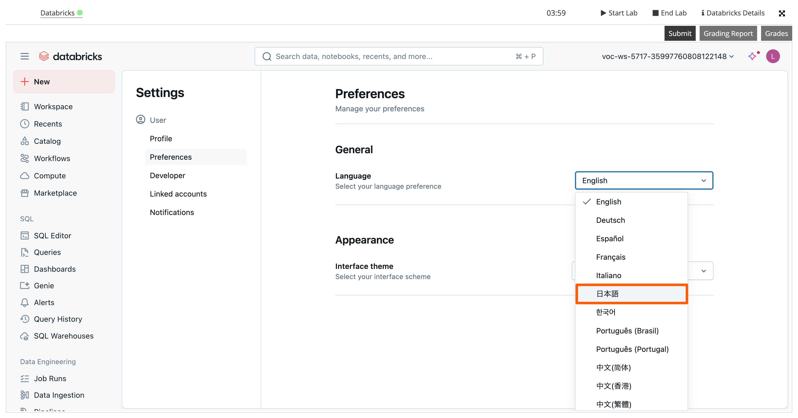

# ハンズオン環境セットアップ手順
ハンズオンの実施に必要な環境準備手順をご案内します。以下の5つのステップを順番に実施してください。不明点がある場合は、遠慮なく講師にお尋ねください。

## Step 1: ラボ環境へのアクセス
ハンズオンではDatabricks Academyのラボ環境（Vocareum）を使用します。

### 事前準備
- [Databricks Academy ラボ環境 利用開始手順](https://speakerdeck.com/databricksjapan/databricks-academy-signup)をブラウザで開きます

### セットアップ手順
上記の手順資料に従って、以下を順番に実施してください。

1. **Databricks Academyへのサインアップ**
    - アカウントを新規作成します

2. **Databricks Academy Labsサブスクリプションの取得**
    - クーポンコード：5月26日（月）送信済みメールに記載されたコードを使用します

3. **ラボ環境へのアクセス**
    - Catalogs in My Subscriptionの画面で以下のコースを検索してください
    - コース名：`Get Started with SQL Analytics and BI on Databricks - Japanese`

## Step 2: ラボ環境の日本語化
ラボ環境の表示言語を日本語に変更します。

> **Note**: 英語表示をご希望の場合は、このステップをスキップしてください。

1. **設定画面にアクセス**
    - 右上のアイコンをクリック
    - [Settings] を選択

    

2. **言語設定の変更**
    - [Preferences] をクリック
    - [Language] を日本語に変更

    

## Step 3: カタログとスキーマの確認
ラボ環境では、ハンズオンで使用するカタログとスキーマが自動的に作成されています。

- カタログ名: `dbacademy`
- スキーマ名: `labuser`から始まるスキーマ名 (各ユーザーごとに異なるスキーマ名が自動生成されます)
    - スキーマ名の例: `labuser10232180_1748183589`

以下の手順でカタログとスキーマを確認します。

1. **カタログの確認**
    - 左側メニューの [カタログ] をクリック
    - `dbacademy` カタログが自動的に作成されていることを確認
    - 後のステップで使用するため、カタログ名をメモしておきましょう

    

2. **スキーマの確認**
    - `dbacademy` カタログをクリック
    - スキーマ一覧に `labuser` から始まるスキーマ名が表示されていることを確認
    - 後のステップで使用するため、スキーマ名をメモしておきましょう

    

## Step 4: Gitリポジトリのクローン
ラボ環境のDatabricksワークスペースに本リポジトリをクローンします。

1. **ホームディレクトリにアクセス**
    - 左側メニューの [ワークスペース] をクリック
    - [ホーム] を選択

    

2. **Gitフォルダの作成**
    - [作成] > [Gitフォルダ] を選択

    

3. **リポジトリ情報の入力**
    以下の設定でGitフォルダを作成してください。

    | 設定項目 | 設定値 |
    |---------|-------|
    | GitリポジトリのURL | `https://github.com/komae5519pv/komae_dbdemos` |
    | Gitプロバイダー | `GitHub` |
    | Gitフォルダ名 | `komae_dbdemos` |
    | スパースチェックアウトモード | ✓（チェック） |
    | コーンパターン | `bootcamp_20250527` |

    

4. **作成完了**
    - [Gitフォルダを作成] をクリックして完了
    - 以下の画面が表示されれば成功

    

## Step 5: サンプルテーブルの作成
Step 4でクローンしたGitリポジトリ内のノートブックを使用して、ハンズオンで使用するサンプルテーブルを作成します。

1. **サンプルテーブル作成用ノートブックを開く**
    - `bootcamp_20250527` フォルダを開く
    - `notebooks` フォルダを開く
    - `01_create_aibi_demo_data_bricksmart` ノートブックを開く

    

2. **1つ目のセルを実行**
    - ノートブックの1つ目のセルを実行 (矢印のアイコンをクリック)
    - ワークスペースでのノートブックの初回実行時の場合、通知を表示の許可を求めるダイアログが表示されるので、許可をクリック

    

3. **ウィジェットを入力・ノートブック全体を実行**
    - ノートブックのウィジェットに以下の情報を入力
        - カタログ: `dbacademy`
        - スキーマ: `labuser` から始まるスキーマ名 (Step 3で確認したスキーマ名を入力)
        - スキーマを再作成：変更不要（`False` のまま）
    - 入力後、[すべてを実行] をクリック

    

4. **実行完了の確認**
    - ノートブックの実行が完了するまで待ちます
    - 一番下までスクロールし、セルが正常終了 (✔︎) していれば成功です

    

以上でハンズオンの準備は完了です。